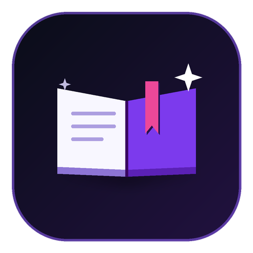
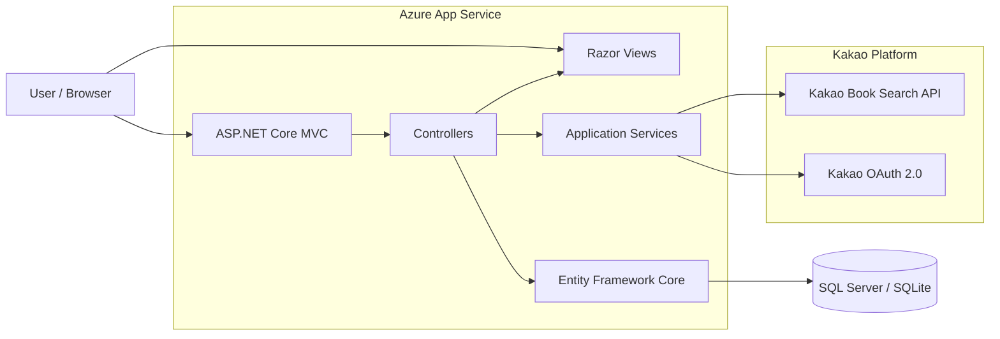
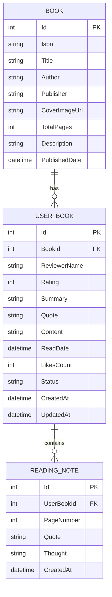

<div align="center">



# 📖 Read.me

### 읽은 책 · 마음에 남은 문장 · 나만의 감상을 한곳에서

**책을 찾고, 읽고 싶은 책을 모으고, 독서록을 작성하고,**  
**다른 독자의 기록까지 함께 둘러볼 수 있는 독서 기록 커뮤니티입니다.**

[](https://readme-f7c0beg0gkafe9cp.koreacentral-01.azurewebsites.net/)
[](https://dotnet.microsoft.com/)
[](https://learn.microsoft.com/aspnet/core/)
[](https://learn.microsoft.com/ef/core/)
[](https://azure.microsoft.com/)
[](https://developers.kakao.com/)

</div>

---

## 🚀 서비스 개요

**Read.me**는 누구나 편하게 자신의 독서 경험을 기록하고 공유할 수 있는 독서 커뮤니티입니다.

카카오 도서 검색을 통해 원하는 책을 찾고, 아직 읽지 않은 책은 **읽고 싶은 책**으로 저장할 수 있습니다. 읽은 뒤에는 별점, 한 줄 평, 인상 깊은 문장, 감상 내용을 독서록으로 남기고 개인 기록에서 관리할 수 있습니다.

완성된 독서록은 **모두의 독서록**에 공개되어 다른 독자의 감상과 함께 탐색할 수 있습니다.

```text
책 찾기
  ↓
읽고 싶은 책에 저장
  ↓
독서록 작성
  ↓
내 독서 기록 관리
  ↓
모두의 독서록 공유
```

### 🔗 주요 페이지

| 서비스 | URL |
| --- | --- |
| 모두의 독서록 | [Read.me](https://readme-f7c0beg0gkafe9cp.koreacentral-01.azurewebsites.net/) |
| 내 독서 기록 | [내 기록](https://readme-f7c0beg0gkafe9cp.koreacentral-01.azurewebsites.net/Books) |
| 독서록 작성 | [독서록 쓰기](https://readme-f7c0beg0gkafe9cp.koreacentral-01.azurewebsites.net/Books/Create) |
| 카카오 로그인 | [로그인](https://readme-f7c0beg0gkafe9cp.koreacentral-01.azurewebsites.net/Auth/Login) |

---

## ✨ 핵심 기능

### 🔎 카카오 도서 검색

카카오 도서 검색 API를 이용해 제목, 저자, 키워드로 책을 찾을 수 있습니다.

- 제목 / 저자 / 키워드 기반 검색
- 책 표지, 저자, 출판사, 출간일, 소개 표시
- 검색 결과 **20권 단위 페이지 요청**
- `더보기` 버튼으로 다음 검색 결과 이어서 조회
- 카카오 API의 `pageable_count`, `is_end`를 이용한 검색 범위 표시
- 검색 결과에서 바로 **독서록 작성**
- 검색 결과에서 **읽고 싶은 책으로 저장**
- 독서록 작성 화면에서도 동일한 도서 검색 지원

### ✍️ 독서록 작성

책을 읽은 뒤 핵심 감상과 문장을 구조화해 기록할 수 있습니다.

- 1~5점 별점
- 한 줄 평
- 인상 깊은 문장
- Markdown 기반 감상문
- 독서 완료 날짜
- 도서 검색 후 자동 정보 입력
- 읽고 싶은 책에서 독서록 작성 시 기존 기록을 완독 기록으로 전환

### 📚 내 독서 기록

로그인한 사용자의 책과 독서록을 한곳에서 관리합니다.

- 전체 기록
- 읽고 싶은 책
- 읽는 중
- 완독
- 책 제목 / 저자 / 기록 내용 검색
- 최근순 / 별점순 정렬
- 12개 단위 페이지네이션
- 본인 독서 기록만 삭제 가능

### 🌿 모두의 독서록

완성된 독서록만 공개 피드에 노출합니다.

- 최신순
- 공감순
- 별점순
- 책 제목 / 저자 / 독서록 내용 / 작성자 통합 검색
- 12개 단위 페이지네이션
- 책 표지, 작성자, 별점, 한 줄 평, 인상 깊은 문장 표시
- 독서록 상세 페이지 제공
- 동일 브라우저의 반복 공감 방지

읽고 싶은 책이나 내용이 없는 임시 기록은 커뮤니티 피드에 노출하지 않습니다.

### 📝 독서 메모

독서 중 기억하고 싶은 내용은 독서록과 별도로 메모할 수 있습니다.

- 페이지 번호 기록
- 책 속 문장 저장
- 개인 생각 및 감상 작성
- Markdown 렌더링
- 작성자 본인만 메모 추가·삭제 가능
- 다른 사용자의 독서록에서는 메모 편집 UI 비노출

### 💬 Markdown

독서 감상과 메모는 **Markdig**를 통해 Markdown으로 렌더링합니다.

- Markdown 문법 지원
- Advanced Extensions 사용
- Raw HTML 비활성화
- 작성 화면 실시간 미리보기
- 사용자 입력 HTML escaping 적용

### 🟡 카카오 로그인

별도의 회원가입 없이 카카오 계정으로 로그인할 수 있습니다.

- Kakao OAuth 2.0
- 카카오 닉네임
- 이메일
- 프로필 이미지
- Cookie Authentication
- 14일 Persistent Login
- 로그인 상태 확인 API

로그인 사용자는 자신의 독서 기록, 메모, 저장 도서를 관리할 수 있습니다.

### ❤️ 공감

다른 독자의 독서록에 공감을 남길 수 있습니다.

- 독서록별 공감 수 저장
- 공감순 정렬
- 브라우저 쿠키 기반 중복 공감 제한
- 로그인 사용자만 공감 가능

### 📤 README Markdown 내보내기

자신의 최근 독서 기록을 GitHub README 등에 붙여 넣을 수 있는 Markdown으로 변환할 수 있습니다.

- 로그인한 사용자의 완독 기록 기준
- 최근 독서록 최대 10개
- 도서명 / 저자 / 별점 / 독서 날짜 표 생성
- 기억하고 싶은 문장 함께 출력
- 클립보드 복사 지원

### 🔎 SEO · Analytics

공개 독서록이 검색엔진에서 탐색될 수 있도록 기본 SEO 설정을 제공합니다.

- `sitemap.xml`
- `robots.txt`
- canonical URL
- Open Graph
- Twitter Card
- Schema.org `WebSite` / `Review` 구조화 데이터
- Google Analytics 4
- 공개 독서록 상세 URL sitemap 포함

---

## 🔌 외부 서비스

| 서비스 | 사용 목적 |
| --- | --- |
| Kakao Book Search API | 도서 검색, 표지, 저자, 출판사, 출간일, 도서 소개 |
| Kakao OAuth 2.0 | 로그인, 사용자 프로필 정보 |
| Google Analytics 4 | 서비스 방문 및 사용 분석 |
| Azure App Service | ASP.NET Core 애플리케이션 운영 |
| GitHub Actions | 빌드·배포 자동화 |

---

## 🛠 기술 스택

### Backend

|  |  |  |
| :---: | :---: | :---: |
| C# | .NET 10 / ASP.NET Core MVC | SQL Server |

<p>
  
  
  
</p>

### Frontend

|  |  |  |  |
| :---: | :---: | :---: | :---: |
| Razor / HTML | CSS | JavaScript / jQuery | Bootstrap |

### Integration & Deployment

|  |  |  |
| :---: | :---: | :---: |
| Kakao API | Azure App Service | GitHub Actions |

---

## 🏗 시스템 아키텍처



배포는 `main` 브랜치 push를 기준으로 GitHub Actions가 **Restore → Build → Publish → Azure App Service Deploy** 순서로 수행합니다.

---

## 🗂 핵심 데이터 구조



현재 카카오 로그인 정보는 Cookie Authentication의 Claims로 유지하며, 독서 기록의 작성자 소유권은 기존 `ReviewerName`과 로그인 사용자 이름을 기준으로 확인합니다.

---

## 📁 프로젝트 구조

```text
Read.me/
├── .github/
│   └── workflows/
│       └── deploy.yml         # GitHub Actions → Azure 자동 배포
├── Controllers/
│   ├── AuthController.cs      # 카카오 로그인 / 로그아웃
│   ├── BooksController.cs     # 독서 기록 CRUD / 공감
│   ├── HomeController.cs      # 공개 독서록 피드 / SEO
│   ├── NotesController.cs     # 독서 메모
│   └── SearchController.cs    # 카카오 도서 검색 / 책 저장
├── Data/
│   └── ReadmeDbContext.cs     # EF Core DbContext
├── Models/
│   ├── Book.cs
│   ├── UserBook.cs
│   ├── ReadingNote.cs
│   ├── ReadingStatus.cs
│   └── ViewModels/
├── Services/
│   ├── KakaoAuthService.cs
│   ├── KakaoBookSearchService.cs
│   └── ReadmeExportService.cs
├── Views/
│   ├── Books/
│   ├── Home/
│   └── Shared/
├── wwwroot/
│   ├── css/
│   ├── js/
│   └── favicon*
├── Program.cs
├── appsettings.json
└── ReadMeApp.csproj
```

---

## ⚙️ 로컬 실행

### 1. 저장소 Clone

```bash
git clone https://github.com/dh1180/Read.me.git
cd Read.me
```

### 2. .NET SDK 확인

.NET 10 SDK가 필요합니다.

```bash
dotnet --version
```

### 3. 의존성 설치

```bash
dotnet restore ReadMeApp.csproj
```

### 4. 환경 설정

개발 환경에서는 환경변수 또는 `appsettings.Development.json`을 사용할 수 있습니다.

예시:

```text
DatabaseProvider=Sqlite
ConnectionStrings__SqliteConnection=Data Source=readme.db

Kakao__RestApiKey=your_kakao_rest_api_key
Kakao__RedirectUri=http://localhost:5077/auth/kakao/callback

# 카카오 앱에서 Client Secret을 사용하는 경우
Kakao__ClientSecret=your_kakao_client_secret
```

Windows에서 LocalDB를 사용하려면 기본 `appsettings.json`의 SQL Server 연결 문자열을 사용할 수 있습니다.

### 5. 개발 서버 실행

```bash
dotnet run
```

기본 HTTP 주소:

```text
Home        http://localhost:5077/
My Books    http://localhost:5077/Books
Write       http://localhost:5077/Books/Create
Login       http://localhost:5077/Auth/Login
```

HTTPS 프로필을 사용하면 `https://localhost:7139`에서도 실행할 수 있습니다.

---

## 🔌 주요 Endpoint

### 도서 검색

```http
GET /Search/Query?q={keyword}&page=1&size=20
```

응답에는 검색 결과와 함께 다음 정보가 포함됩니다.

```text
items
page
pageSize
pageableCount
totalCount
isEnd
```

### 카카오 로그인

```http
GET  /Auth/Login
GET  /auth/kakao/callback
POST /Auth/Logout
GET  /Auth/Status
```

### 독서 기록

```http
GET  /Books
GET  /Books/Details/{id}
GET  /Books/Create
POST /Books/Create
POST /Books/Like/{id}
POST /Books/Delete/{id}
```

### 독서 메모

```http
POST /Notes/Create
POST /Notes/Delete
```

---

## 🚢 Deployment

서비스는 **Azure App Service**에 배포되며 GitHub Actions로 자동화되어 있습니다.

`main` 브랜치 push 시:

```text
Checkout
   ↓
.NET 10 SDK Setup
   ↓
dotnet restore
   ↓
dotnet build -c Release
   ↓
dotnet publish
   ↓
Artifact Upload
   ↓
Azure App Service Deploy
```

GitHub Actions Secret:

```text
AZURE_WEBAPP_PUBLISH_PROFILE
```

운영 환경에서는 Azure App Service의 Connection String / Application Settings를 통해 DB 및 Kakao API 설정을 주입할 수 있습니다.

---

## 🔐 보안 및 운영 원칙

Read.me는 사용자 입력과 개인 기록을 다루기 때문에 다음 원칙을 적용합니다.

- Cookie Authentication의 `HttpOnly` 적용
- `SameSite=Lax`
- 로그인 기반 작성·삭제 권한 확인
- 독서록 및 메모 삭제 시 작성자 소유권 확인
- ASP.NET Core 전역 Anti-Forgery 검증
- Ajax 요청에도 Anti-Forgery Token 전달
- Markdown Raw HTML 비활성화
- 미리보기 사용자 입력 HTML escaping
- 읽고 싶은 책과 공개 독서록 데이터 분리
- 공개 피드에는 완성된 독서록만 노출
- 운영 DB와 개발 SQLite를 분리해 사용할 수 있도록 구성

현재 데이터베이스는 기존 운영 데이터와의 호환성을 위해 `EnsureCreated()` 기반으로 동작합니다. 향후 사용자 테이블과 불변 사용자 ID를 도입할 경우 EF Core Migration 기반으로 전환하는 것을 목표로 합니다.

---

## 👨‍💻 Maintainer

<div align="center">

[](https://github.com/dh1180)

**Read.me**  
책을 읽고, 기억하고, 함께 나누는 독서 기록 커뮤니티

</div>
