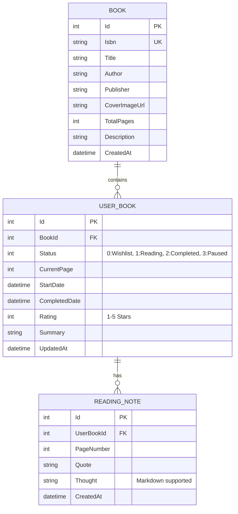

# 📖 Read.me — Developer-Centric Reading Journal

[](https://dotnet.microsoft.com/)
[](https://dotnet.microsoft.com/apps/aspnet)
[](https://www.microsoft.com/sql-server)
[](https://jquery.com/)
[](https://azure.microsoft.com/)
[](LICENSE)

> **Read.me**는 개발자의 독서 경험과 지식 아카이빙을 극대화하기 위해 설계된 스마트 독서록 웹 애플리케이션입니다.  
> 책 속 인상 깊은 문장을 **마크다운(Markdown)**으로 기록하고, **jQuery Ajax** 기반의 매끄러운 비동기 인터랙션으로 독서 진행률을 추적하며, 내 독서 통계를 **GitHub Profile용 `README.md`** 형식으로 원클릭 추출할 수 있습니다.

---

## 🌟 Key Features (핵심 기능)

1. **도서 검색 및 원클릭 서재 등록 (jQuery Ajax)**
   - 페이지 새로고침 없이 모달 팝업에서 Kakao Open API 및 추천 도서를 실시간으로 검색하고 내 서재에 즉시 추가합니다.
2. **독서 상태 & 실시간 진행률 슬라이더 (Ajax)**
   - `읽는 중`, `완독`, `읽고 싶은 책` 등 상태별 서재 관리.
   - 슬라이더 및 빠른 입력창을 통해 비동기(`$.ajax`)로 현재 읽은 페이지와 진행률(%)을 데이터베이스에 실시간 반영합니다.
3. **마크다운(Markdown) 기반 필사 & 독서 메모**
   - 책 속 구절(Quote)과 나의 생각(Thought)을 마크다운 문법으로 작성.
   - 클라이언트 사이드 실시간 미리보기와 Markdig 엔진을 통한 안전한 HTML 렌더링 지원.
4. **GitHub 프로필용 "Export to README.md" (시그니처 기능)**
   - 현재 읽고 있는 도서의 프로그레스 바(`[████████░░] 80%`), 최근 완독 도서, 올해의 베스트 인용구를 GitHub 프로필에 바로 복사/붙여넣기할 수 있는 텍스트로 자동 생성합니다.
5. **엔터프라이즈급 아키텍처 & Azure CI/CD 파이프라인**
   - Microsoft ASP.NET Core MVC 패턴과 EF Core를 통한 MS SQL Server (Azure SQL Database) 완벽 지원.
   - GitHub Actions 기반의 Azure App Service 자동 배포 워크플로우 내장.

---

## 🏗 System Architecture & Tech Stack

```
[ Client (Browser) ]
      │
      ├── Razor Views (.cshtml) & Bootstrap 5
      └── jQuery 3.7+ (Ajax $.get / $.post)
            │  (JSON Async HTTP Requests)
            ▼
[ ASP.NET Core MVC Controller Layer ]
      ├── HomeController (Dashboard, Export API)
      ├── BooksController (Library View, Progress Ajax)
      ├── SearchController (Book Search & Add Ajax)
      └── NotesController (Markdown Notes CRUD Ajax)
            │
            ▼
[ Service Layer & EF Core ]
      ├── IBookSearchService (Kakao API & Fallback)
      ├── IReadmeExportService (Markdown Generator)
      └── ReadmeDbContext (Entity Framework Core)
            │
            ▼
[ Database & Cloud Deployment ]
      ├── Microsoft SQL Server (LocalDB / Azure SQL Database)
      └── Microsoft Azure App Service (Windows Server Platform)
```

| 구분 | 기술 스택 | 설명 |
| :--- | :--- | :--- |
| **Backend** | **ASP.NET Core MVC (.NET 10, C# 13)** | 고성능 웹 프레임워크 및 클린 MVC 아키텍처 |
| **ORM / Data** | **Entity Framework Core (EF Core)** | LINQ 기반 쿼리, Code-First 마이그레이션 |
| **Database** | **Microsoft SQL Server / Azure SQL** | 엔터프라이즈 RDBMS (로컬 SQLite 자동 폴백 지원) |
| **Frontend** | **Razor View + jQuery (Ajax) + Bootstrap 5** | 비동기 데이터 바인딩 및 반응형 대시보드 UI |
| **Markdown** | **Markdig** | 고성능 마크다운 파서 및 실시간 프리뷰 렌더러 |
| **CI / CD** | **GitHub Actions** | `main` 브랜치 푸시 시 Azure App Service 자동 빌드/배포 |

---

## 🗄 Database Model (ERD)



---

## 🚀 Getting Started (로컬 실행 방법)

### 1. 전제 조건
- [.NET SDK 10.0+](https://dotnet.microsoft.com/download)
- (선택) MS SQL Server 또는 LocalDB

### 2. 프로젝트 클론 및 패키지 복원
```bash
git clone https://github.com/dh1180/Read.md.git
cd Read.md
dotnet restore
```

### 3. 애플리케이션 실행
```bash
dotnet run
```
브라우저에서 `https://localhost:5001` 또는 콘솔에 표시된 포트로 접속합니다.  
(초기 실행 시 샘플 도서 3권과 필사 메모가 자동으로 시드되어 즉시 기능을 체험할 수 있습니다.)

---

## 🤝 Git & Commit Convention

본 프로젝트는 일관된 코드 품질과 가독성을 위해 **Conventional Commits** 규칙을 준수합니다.

| Prefix | 설명 | 예시 |
| :--- | :--- | :--- |
| `feat:` | 새로운 기능 추가 | `feat: 도서 검색 Ajax 비동기 쿼리 API 구현` |
| `fix:` | 버그 및 오류 수정 | `fix: 진행률 슬라이더 최대 페이지 초과 오류 수정` |
| `style:` | 코드 포맷팅, UI 스타일 변경 | `style: 대시보드 카드 호버 그림자 효과 개선` |
| `refactor:` | 프로덕션 코드 리팩터링 | `refactor: 마크다운 변환 로직 서비스 분리` |
| `chore:` | 빌드 설정 및 패키지 관리 | `chore: Azure CI/CD 배포 워크플로우 추가` |
| `docs:` | 문서 작성 및 수정 | `docs: README 아키텍처 다이어그램 및 사용 가이드 추가` |
| `test:` | 테스트 코드 추가/수정 | `test: 도서 진행률 계산 단위 테스트 추가` |

---

## 📋 Pull Request Template
새로운 기능 또는 버그 수정을 반영할 때는 [`.github/pull_request_template.md`](.github/pull_request_template.md) 양식을 작성하여 PR을 생성합니다.

---

## 📄 License
This project is licensed under the MIT License - see the [LICENSE](LICENSE) file for details.
