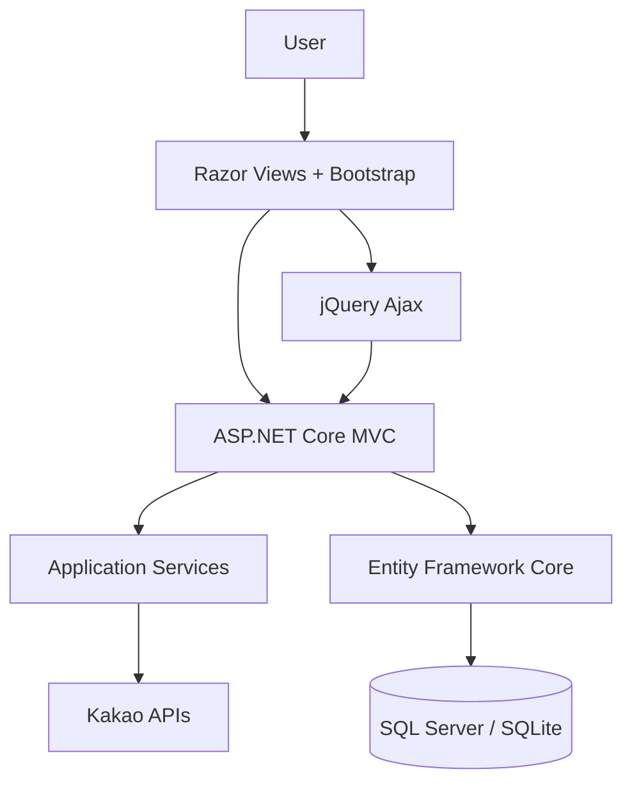
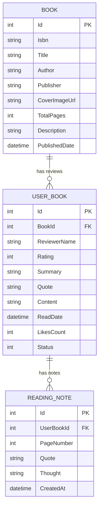

<div align="center">

# 📖 Read.me

### 책에서 발견한 문장과 생각을 기록하고 나누는 독서 커뮤니티

**도서를 검색해 독서록을 작성하고, 다른 사람의 기록을 둘러보며,**  
**최근 독서 기록을 GitHub 프로필용 Markdown으로 내보낼 수 있는 웹 서비스입니다.**

[](https://dotnet.microsoft.com/)
[](https://learn.microsoft.com/aspnet/core/)
[](https://learn.microsoft.com/ef/core/)
[](https://www.microsoft.com/sql-server)
[](https://www.sqlite.org/)
[](https://azure.microsoft.com/products/app-service)

</div>

---

## 🚀 서비스 개요

**Read.me**는 책을 읽고 남긴 감상, 한 줄 평, 기억하고 싶은 문장을 한곳에 모아 공유하는 독서록 서비스입니다.

카카오 도서 검색 API로 책 정보를 불러오고, 별점과 독서록을 작성하면 커뮤니티 피드에서 최신순·인기순·별점순으로 다른 기록과 함께 살펴볼 수 있습니다. 상세 페이지에서는 페이지별 메모를 Markdown으로 남길 수 있으며, 최근 독서 기록은 GitHub 프로필에 붙여 넣을 수 있는 `README.md` 형식으로 바로 내보낼 수 있습니다.

```text
도서 검색 → 독서록 작성 → 커뮤니티 공유 → 메모 기록 → README 내보내기
```

---

## ✨ 핵심 기능

### 🔎 카카오 도서 검색

- 카카오 도서 검색 API 기반 제목·저자 검색
- 표지, ISBN, 저자, 출판사, 책 소개 자동 입력
- API 키가 없는 개발 환경에서는 추천 도서 데이터로 동작
- Ajax 기반 검색과 서재 등록으로 페이지 전환 최소화

### ✍️ 독서록 작성 및 공유

- 작성자명, 별점, 한 줄 평, 인상 깊은 문장, 감상 본문 기록
- 도서 정보와 독서록을 분리해 동일 도서의 메타데이터 재사용
- 작성된 독서록을 카드형 커뮤니티 피드로 제공
- 최신순·인기순·별점순 정렬 및 도서명·저자·본문 통합 검색

### ❤️ 독서록 탐색과 반응

- 독서록 상세 내용과 도서 정보 확인
- Ajax 기반 좋아요 반영
- 인기 도서와 전체 독서록을 한 화면에서 탐색

### 📝 Markdown 독서 메모

- 독서록 상세 페이지에서 페이지 번호, 인용문, 생각 기록
- Markdig를 이용한 Markdown 렌더링
- 메모 작성·삭제를 Ajax로 처리

### 🧾 GitHub README 내보내기

- 최근 독서록 최대 10건을 Markdown 표로 변환
- 도서명, 저자, 별점, 작성자, 독서일 포함
- 기억하고 싶은 문장과 한 줄 평을 인용문 형식으로 구성
- 생성된 Markdown을 GitHub 프로필 README에 바로 활용

### 🟡 카카오 로그인

- 카카오 OAuth 2.0 인가 코드 흐름 연동
- Cookie Authentication 기반 로그인 상태 유지
- 닉네임과 프로필 이미지 표시
- 인증 쿠키 14일 유지 및 Sliding Expiration 적용

---

## 🏗 Architecture



### 주요 요청 흐름

| 기능 | 처리 흐름 |
| --- | --- |
| 도서 검색 | `SearchController → KakaoBookSearchService → Kakao Book API` |
| 독서록 작성 | `BooksController → ReadmeDbContext → Book / UserBook` |
| 독서 메모 | `NotesController → ReadingNote → Markdig` |
| 카카오 로그인 | `AuthController → KakaoAuthService → Cookie Authentication` |
| README 내보내기 | `HomeController → ReadmeExportService → Markdown` |

---

## 🛠 기술 스택

### Backend

|  |  |  |  |
| :---: | :---: | :---: | :---: |
| C# | ASP.NET Core MVC | SQL Server | SQLite |

### Frontend & Integration

|  |  |  |  |
| :---: | :---: | :---: | :---: |
| JavaScript | jQuery / Ajax | Bootstrap | Azure App Service |

### 주요 라이브러리와 외부 연동

- Entity Framework Core 10
- Markdig
- Kakao Book Search API
- Kakao OAuth 2.0
- GitHub Actions

---

## 🗄 Data Model



---

## 📁 프로젝트 구조

```text
Read.md/
├── Controllers/
│   ├── AuthController.cs       # 카카오 로그인·로그아웃
│   ├── BooksController.cs      # 독서록 조회·작성·좋아요·삭제
│   ├── HomeController.cs       # 메인 피드·README 내보내기
│   ├── NotesController.cs      # Markdown 독서 메모
│   └── SearchController.cs     # 도서 검색·서재 등록
├── Data/
│   └── ReadmeDbContext.cs      # EF Core Context·샘플 데이터
├── Models/                     # Book·UserBook·ReadingNote
├── Services/
│   ├── KakaoAuthService.cs
│   ├── KakaoBookSearchService.cs
│   └── ReadmeExportService.cs
├── Views/                      # Razor Views
├── wwwroot/                    # CSS·JavaScript·정적 라이브러리
├── .github/workflows/deploy.yml
├── Program.cs
├── ReadMeApp.csproj
└── appsettings.json
```

---

## ⚙️ 로컬 실행

### 1. 요구 사항

- [.NET SDK 10.0 이상](https://dotnet.microsoft.com/download)
- SQL Server LocalDB 또는 SQLite
- 선택 사항: 카카오 REST API 키

### 2. 저장소 Clone 및 의존성 복원

```bash
git clone https://github.com/dh1180/Read.md.git
cd Read.md
dotnet restore
```

### 3. 데이터베이스 선택

기본 설정은 Windows의 SQL Server LocalDB를 사용합니다. 별도 DB 설치 없이 실행하려면 SQLite를 선택합니다.

macOS / Linux:

```bash
export DatabaseProvider=Sqlite
```

Windows PowerShell:

```powershell
$env:DatabaseProvider="Sqlite"
```

### 4. 카카오 API 설정

카카오 도서 검색과 로그인을 사용하려면 환경변수를 설정합니다. API 키가 없어도 추천 도서 기반으로 기본 기능을 확인할 수 있습니다.

macOS / Linux:

```bash
export Kakao__RestApiKey="your_rest_api_key"
export Kakao__RedirectUri="https://localhost:7139/auth/kakao/callback"
```

Windows PowerShell:

```powershell
$env:Kakao__RestApiKey="your_rest_api_key"
$env:Kakao__RedirectUri="https://localhost:7139/auth/kakao/callback"
```

### 5. 애플리케이션 실행

```bash
dotnet run
```

```text
HTTP   http://localhost:5077
HTTPS  https://localhost:7139
```

첫 실행 시 데이터베이스와 샘플 독서록이 자동으로 생성됩니다.

---

## 🚢 CI/CD

GitHub Actions는 `main` 브랜치의 Push와 Pull Request에서 다음 작업을 수행합니다.

```text
Restore → Build → Test → Publish
```

`main` 브랜치 Push 시 `AZURE_WEBAPP_PUBLISH_PROFILE` Secret이 설정되어 있으면 Azure App Service까지 자동 배포합니다.

---

## 👨‍💻 Maintainer

<div align="center">

[](https://github.com/dh1180)

**Read.me**  
책에서 발견한 문장과 생각을 기록하고 나누는 독서 커뮤니티

</div>
